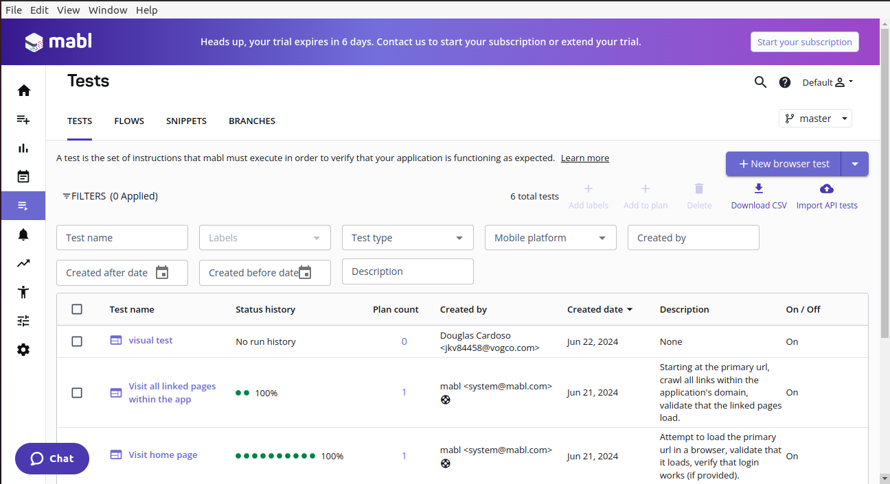

# Instalação
- Será necessário criar uma conta de e-mail temporária ou utilizar uma corporativa. Para criar contas temporárias pode-se usar o site [10minutemail](https://10minutemail.net/).
- Vá ao [site](https://www.mabl.com/trial-registration) da ferramenta e faça o registro usando o email recém criado

```
sudo snap install mabl-app --classic
mabl-app
```
- Se for necessário logar na ferramenta, utilize o email acima.
- A página inicial da ferramenta será aberta

