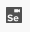
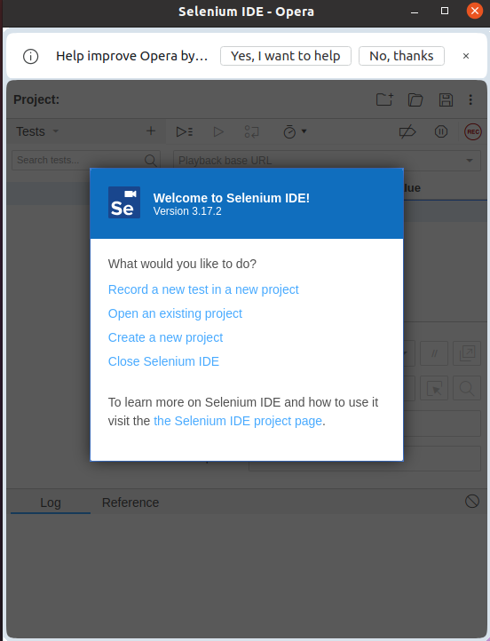
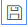

# Instalação
- Visite o site https://www.selenium.dev/selenium-ide/
- Clique no botão referente ao seu navegador
- Na página que abrir clique em "Add to [navegador]"
- Aceite as condições de utilização
- Um ícone como esse  aparecerá no canto superior direito do navegador

# Gravação do teste
- Clique no ícone. Uma nova tela aparecerá

- Selecione "Record a new test in a new project"
- Indique o nome do projeto, por exemplo "demo"
- Informe a URL do site que deseja gravar, exemplo "https://www.selenium.dev/selenium/web/web-form.html". O site será aberto.
- Faça algumas interações com a págien, por exemplo preenchendo algum campo ou clicando em algum link ou botão
- Feche o navegar que foi aberto
- Na IDE do Selenum clique em  para parar a gravação
- Informe um nome pra o teste, exemplo "demo"
- Você pode salvar o projeto clicando no ícone de disquete 

# Execução
- Selecione o teste que acabou de gravar e clique em . O teste será executado e será possível ver o log da execução

